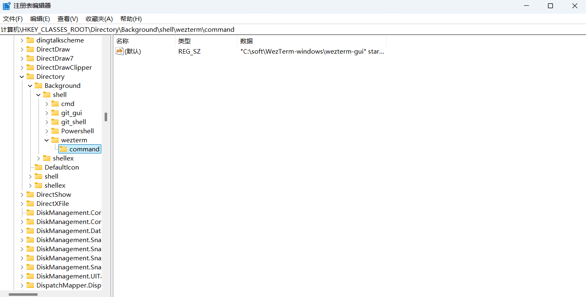

<div align="center" id="madewithlua">
  
</div>

<h1 align="center">WezTerm</h1>

<div align="center">
  <a href="https://github.com/QianSong1/wezterm-config/releases"></a>
  <a href="https://github.com/QianSong1/wezterm-config/stargazers"></a>
  <a href="https://github.com/QianSong1/wezterm-config/issues"></a>
  <br />
  <a href="https://github.com/QianSong1/wezterm-config/blob/main/LICENSE"></a>
  <a href="https://github.com/QianSong1/wezterm-config"></a>
</div>

<p align="center" style="font-weight: bold;">
A GPU-accelerated cross-platform terminal emulator and multiplexer written by <a href="https://github.com/wez">@wez</a> and implemented in <a href="https://www.rust-lang.org">Rust</a>
</p>
<p align="center">
User facing docs and guide at: <a style="font-weight: bold;" href="https://wezterm.org">wezterm.org</a>
</p>


# 我的 WezTerm 配置

一个为 Windows 优化的高度定制化 WezTerm 终端配置，支持多种 shell 和丰富的快捷键操作。

## ✨ 主要特性

- 🎨 **大窗口设计**: 180x60 字符显示区域
- 🐟 **Fish Shell**: 默认使用 MSYS2 Fish
- 🚀 **高效快捷键**: 完整的分屏、导航、调整功能
- 🎯 **无冲突设计**: 避免与系统快捷键冲突
- 📖 **完整文档**: 详细的使用说明和配置指南

## 📁 项目结构

```
.config/wezterm/
├── config/
│   ├── appearance.lua    # 外观和窗口设置
│   ├── bindings.lua      # 键位绑定配置
│   ├── fonts.lua         # 字体配置
│   └── launch.lua        # 启动配置
├── utils/
│   └── platform.lua      # 平台检测工具
├── docs/                 # 📚 完整使用文档
│   ├── README.md         # 主要使用文档
│   ├── shortcuts.md      # 快捷键参考
│   └── configuration.md  # 配置选项说明
└── README.md             # 项目说明
```

## 🚀 快速开始

### 前置条件

1. **安装 WezTerm**
   ```bash
   # 从官网下载安装包
   # https://wezterm.org/
   ```

2. **安装字体**
   - [JetBrainsMono Nerd Font](https://github.com/ryanoasis/nerd-fonts)
   - 字体版本: v3.2.1

3. **安装 MSYS2**
   - 确保 MSYS2 已安装并配置了 Fish shell
   - 路径: `C:\msys64\`

### 安装步骤

1. **克隆配置**
   ```bash
   git clone https://github.com/Venancio-01/wezterm-config.git
   ```

2. **复制配置文件**
   ```bash
   # 将配置文件复制到 WezTerm 配置目录
   cp -r wezterm-config/* ~/.config/wezterm/
   ```

3. **重启 WezTerm**
   - 完全关闭并重新启动 WezTerm

## ⌨️ 核心快捷键

### 分屏操作
- `Ctrl + Alt + ↓` - 垂直分屏
- `Ctrl + Alt + →` - 水平分屏
- `Ctrl + Alt + -` - 关闭窗格

### 窗格导航
- `Alt + ↑↓←→` - 聚焦对应方向窗格
- `Alt + W` - 关闭当前窗格

### 基础操作
- `F2` - 打开命令面板
- `Ctrl + Shift + C/V` - 复制/粘贴
- `Ctrl + ↑↓` - 调整字体大小

## 📖 完整文档

查看 `docs/` 文件夹获取详细文档：

- **[使用指南](docs/README.md)** - 完整的安装和使用说明
- **[快捷键参考](docs/shortcuts.md)** - 所有快捷键的详细列表
- **[配置选项](docs/configuration.md)** - 深入的配置参数说明

## 🔧 自定义配置

### 修改窗口大小
编辑 `config/appearance.lua`:
```lua
initial_cols = 200,  -- 修改列数
initial_rows = 80,  -- 修改行数
```

### 添加新的 Shell
编辑 `config/launch.lua`:
```lua
{
  label = "新 Shell",
  args = { "路径到/shell.exe" },
},
```

### 自定义快捷键
编辑 `config/bindings.lua` 添加新的键位绑定。

## 🐛 常见问题

### Fish Shell 启动问题
如果遇到 Fish Shell 启动错误：
1. 检查 MSYS2 安装：`C:\msys64\`
2. 安装 Fish：`pacman -S fish`
3. 安装系统工具：`pacman -S coreutils`

### 字体显示问题
如果图标显示异常：
1. 确认安装了正确版本的 Nerd Font
2. 检查 WezTerm 字体设置
3. 重启 WezTerm

## 🤝 贡献

欢迎提交 Issue 和 Pull Request 来改进这个配置！

## 📄 许可证

MIT License 


## 相关链接

- <https://github.com/rxi/lume>
- <https://github.com/catppuccin/wezterm>
- <https://github.com/wezterm/wezterm/discussions/628#discussioncomment-1874614>
- <https://github.com/wezterm/wezterm/discussions/628#discussioncomment-5942139>
- <https://github.com/wezterm/wezterm/discussions/628#discussioncomment-3649195>


## 原作者仓库

- <https://github.com/KevinSilvester/wezterm-config>


## 前提条件

**1、安装`wezterm`终端**

[WezTerm终端](https://github.com/wezterm/wezterm/releases)

安装目录：C:\soft\WezTerm-windows

**2、安装`nerdfont`字体**

[MesloLGM Nerd Font](https://github.com/ryanoasis/nerd-fonts/blob/v3.2.1/patched-fonts/Meslo/M/Regular/MesloLGMNerdFont-Regular.ttf)

[JetBrainsMono NF](https://github.com/ryanoasis/nerd-fonts/blob/v3.2.1/patched-fonts/JetBrainsMono/Ligatures/Regular/JetBrainsMonoNerdFont-Regular.ttf)

字体版本 `v3.2.1` ，注意了，版本很重要，如果某些图标弃用了或更新了，那么就需要更新字体版本，或者更新图标，**总而言之：必须让字体版本与图标对应上，否则就会出现奇怪的乱码**

[图标 icon 搜索网站](https://www.nerdfonts.com/cheat-sheet)


## 使用方法

1、下载本储存库压缩包

2、解压压缩包

3、将解压的文件放入：`$HOME/.config/wezterm`目录底下

Windows目录：`C:\Users\Fizz\.config\wezterm`


## 快捷键

```bash
#快捷键
Ctrl+shift+c    --复制
Ctrl+shift+v    --粘贴
Ctrl+shift+r    --重命名标签栏
Ctrl+alt+[\]    --水平拆分窗格，即左右拆分
Ctrl+alt+[/]    --垂直拆分窗格，即上下拆分
Ctrl+alt+[-]    --关闭当前窗格
Ctrl+alt+z      --最大化/最小化当前窗格
F11             --全屏
Ctrl+alt+[↑]    --向上扩展窗格
Ctrl+alt+[↓]    --向下扩展窗格
Ctrl+alt+[←]    --向左扩展窗格
Ctrl+alt+[→]    --向右扩展窗格
Alt+[↑]         --放大字体
Alt+[↓]         --缩小字体
Alt+r           --重置字体大小
```


## 配置右键菜单

win+r 输入 regedit 打开注册表编辑器，依次展开`HKEY_CLASSES_ROOT`

- 底下的 `HKEY_CLASSES_ROOT\Directory` 
- 底下的 `HKEY_CLASSES_ROOT\Directory\Background` 
- 底下的  `HKEY_CLASSES_ROOT\Directory\Background\shell` 
- 新建一个项 `wezterm` ，在 `wezterm` 编辑 `Icon` 数据指向wezterm安装程序图标，编辑 `（默认）` 数据为菜单名称如 `Open Wezterm Here`，

  

然后右键新建一个项`command`，编辑 `（默认）` 数据：`"C:\soft\WezTerm-windows\wezterm-gui" start --no-auto-connect --cwd "%V\\"`

  


**完成~~~ 享受**🎉🎉🎉

